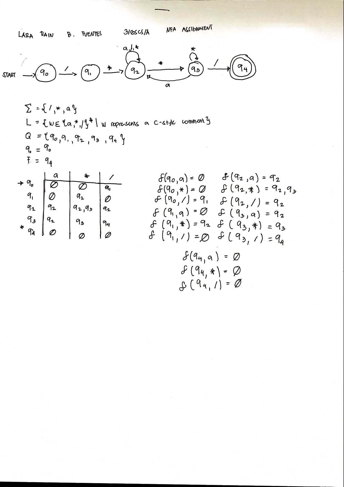
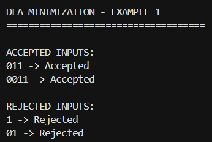
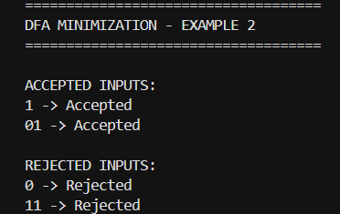
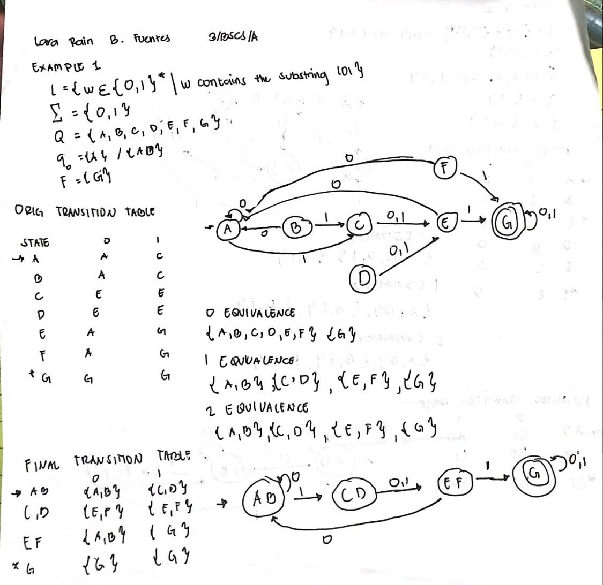
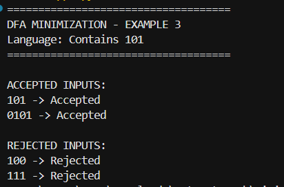
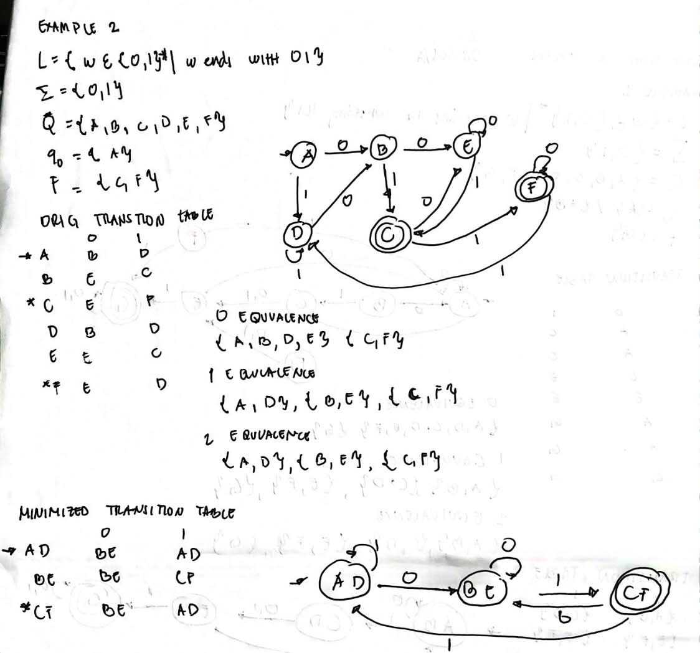
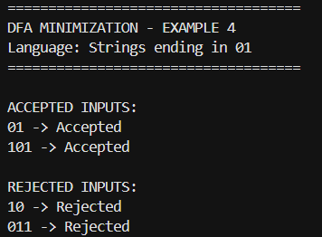

# NFA for C-Style Comments and DFA Minimization

## 1. NFA for C-Style Comments

### 1.1 Description

This project implements a Non-deterministic Finite Automaton (NFA) for recognizing valid C-style comments.

A valid C-style comment starts with `/*` and ends with `*/`.

The symbol `a` represents any character other than `*` and `/`.

### 1.2 Handwritten NFA Requirements

The following image contains the required handwritten work:

- NFA Transition Diagram
- Transition Table
- Transition Function

### 1.3 C# Program

The NFA was implemented using C#. The program asks the user to enter an input string and determines whether the string is accepted or rejected by the NFA.

### 1.4 Accepted Inputs

The following screenshots show examples of inputs that were accepted by the program.

#### Accepted Input 1

#### Accepted Input 2

#### Accepted Input 3

### 1.5 Rejected Inputs

The following screenshots show examples of inputs that were rejected by the program.

#### Rejected Input 1

#### Rejected Input 2

#### Rejected Input 3

---

# 2. DFA Minimization

## 2.1 Description

This section contains DFA minimization examples using equivalence classes.

The DFA minimization process includes:

- Original DFA transition table
- Original DFA transition diagram
- Equivalence partitioning
- Minimized DFA transition table
- Minimized DFA transition diagram
- Python implementation
- Accepted and rejected test inputs

## 2.2 Sir Josh Examples

### Sir Josh Example 1

The following screenshot shows the program output for Sir Josh Example 1.

### Sir Josh Example 2

The following screenshot shows the program output for Sir Josh Example 2.

## 2.3 New DFA Minimization Examples

### New Example 1

This example demonstrates DFA minimization for a language that accepts strings containing `101`.

The handwritten solution includes:

- Original DFA transition diagram
- Original transition table
- Equivalence partitions
- Minimized DFA transition table
- Minimized DFA transition diagram

The following screenshot shows the Python program output, including accepted and rejected test inputs.

### New Example 2

This example demonstrates DFA minimization for a language that accepts strings ending in `01`.

The handwritten solution includes:

- Original DFA transition diagram
- Original transition table
- Equivalence partitions
- Minimized DFA transition table
- Minimized DFA transition diagram

The following screenshot shows the Python program output, including accepted and rejected test inputs.

## 2.4 Python Programs

The Python programs for the new DFA minimization examples are located in the `Minimization DFA` folder.

